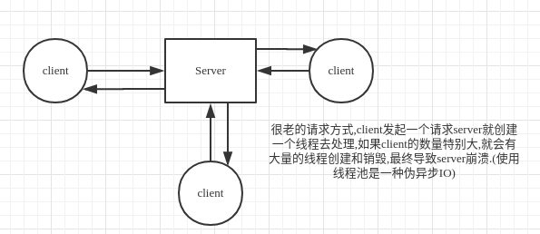
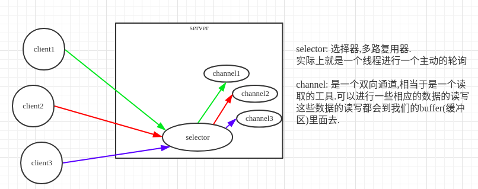
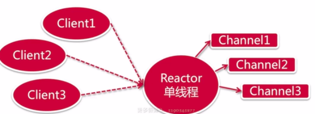
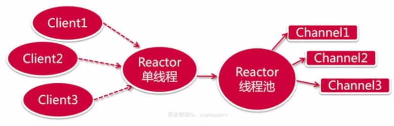
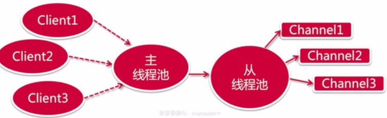

# Netty-SpringBoot学习笔记
## Netty初始
### IO基本概念
#### 阻塞和非阻塞
>如果说当前这个资源没有准备就绪,在这个时候该线程就会有两种处理的方式,一种就是阻塞,一种就是非阻塞

* 阻塞: 该线程会一直持续等待这个资源处理完毕,直到它响应返回一个结果,这个时候我们的线程是一直阻塞的状态,不可以去做任何的事情
* 非阻塞: 该线程会直接返回一个结果,不会持续的等待这个资源处理完毕才去响应,它会去请求别的资源
#### 同步和异步
> 同步和异步是指访问数据的一种机制

#### BIO,NIO,AIO的区别
* BIO
    * 同步阻塞IO, Block IO : 一直等
    * 举个例子: 当我想厕所时,发现厕所的坑位不足,我**主动的等**待坑位.

* NIO
    * 同步非阻塞IO, New IO (Non-Block IO): 不是一直等,等待的同时做一些别的事情 
    * 例子: 还是上面的例子,只是这时候当坑位不足时,我不会一直等待,我回出去玩玩手机抽根烟,时不时主动回厕所看一下有没有坑位

* AIO(相当于是NIO2.0,即在NIO的基础上引入异步的概念)
    * 异步非阻塞IO: 理解下面的例子后我们就相当于在厕所外面干自己的事情,等到有人通知后才去上厕所. 
    * 理解异步阻塞IO(几乎是用不到的): 还是上厕所的例子,厕所坑全满了,我比较懒什么都不干一直等着,让每一个坑位的用户主动在释放坑位之后来通知我这个坑位可以用了,在有人通知我之后我才去上
#### 三种IO的区别总结
* BIO: 发起请求——> 一直阻塞——>处理完成
* NIO: Selector主动轮询channel——> 处理请求——> 处理完成
* AIO: 发起请求---------> 通知回调
#### 常见的面试题
* BIO,NIO,AIO之间的区别是什么?
* 什么是同步阻塞BIO?
* 什么是同步非阻塞的NIO?
* 什么是异步非阻塞的AIO?
### Netty基本概念
* Netty: 是一个提供了易于使用的API的客户端/服务端的框架
* 并发高: NIO(非阻塞IO)
* 快传输: 零拷贝
* 使用NIO所遇到的问题:
    * 类库以及API使用起来相对比较复杂
    * 必须具备很好的Java多线程的知识才可以很好的使用NIO里面的相关的API
* 使用Netty的优点:
    * API使用起来简单
    * 开发门槛也是非常的低
#### Reactor线程模型
单线程模型: 所有的IO操作都由同一个NIO线程处理

多线程模型: 由一组NIO线程处理IO操作

主从线程模型: 一组线程池接受请求,一组线程池处理IO

### Netty服务器

* 构建一对主从线程组
* 定义服务器启动类
* 为服务器设置channel
* 设置处理从线程池的助手类初始化器
* 监听启动和关闭服务器